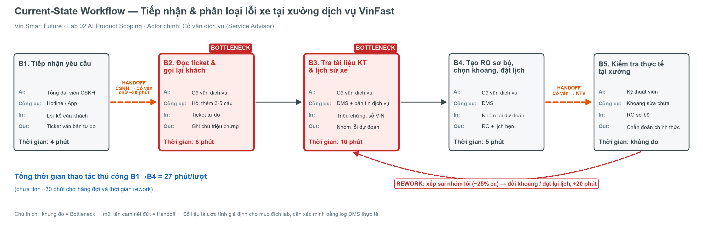

# 02 — Deep-Dive Report: VinFast Service Triage Co-pilot

> **Bài toán:** Phân loại sơ bộ lỗi xe điện VinFast từ mô tả tiếng Việt của khách hàng và soạn nháp lệnh sửa chữa (Repair Order — RO) cho Cố vấn dịch vụ.
> **Đơn vị:** Vin Smart Future × Khối Dịch vụ sau bán hàng VinFast
> **Nguồn bài toán:** Card #1 trong [01-problem-scan.md](01-problem-scan.md)
> **Lưu ý về số liệu:** Các con số thời gian/khối lượng là **ước tính giả định** cho mục đích lab (chưa có quyền truy cập log DMS thật). Chính vì vậy, việc đo baseline được đặt làm điều kiện trong quyết định ở Phase 5.

---

# 🏗️ Phase 3 — DEEP-DIVE

## 3.1. Current-State Workflow Mapping

Sơ đồ trực quan: [04-workflow-diagram.png](04-workflow-diagram.png)



```text
┌────────────────┐        ┌────────────────┐     ┌────────────────┐     ┌────────────────┐        ┌────────────────┐
│ B1. Tiếp nhận  │  🔄    │ B2. Đọc ticket │     │ B3. Tra tài    │     │ B4. Tạo RO sơ  │  🔄    │ B5. Kiểm tra   │
│ yêu cầu        │ ─────→ │ & gọi lại khách│ ──→ │ liệu KT + lịch │ ──→ │ bộ, chọn khoang│ ─────→ │ thực tế tại    │
│                │ chờ    │ hỏi thêm       │     │ sử xe trên DMS │     │ & đặt lịch     │        │ xưởng          │
│ Ai: Tổng đài   │ ~30'   │ Ai: Cố vấn DV  │     │ Ai: Cố vấn DV  │     │ Ai: Cố vấn DV  │        │ Ai: Kỹ thuật   │
│ viên CSKH      │        │                │     │                │     │                │        │ viên (KTV)     │
│ ⏱ 4 phút       │        │ ⏱ 8 phút 🔴    │     │ ⏱ 10 phút 🔴   │     │ ⏱ 5 phút       │        │ ⏱ (ngoài phạm  │
│ In: lời kể     │        │ In: ticket tự do│    │ In: triệu chứng│     │ In: nhóm lỗi   │        │    vi đo)      │
│ Out: ticket    │        │ Out: ghi chú   │     │ Out: nhóm lỗi  │     │ Out: RO + lịch │        │ Out: chẩn đoán │
│ mô tả tự do    │        │ triệu chứng    │     │ dự đoán        │     │ hẹn            │        │ chính thức     │
└────────────────┘        └────────────────┘     └────────────────┘     └────────────────┘        └────────────────┘
                                                        ▲                                                  │
                                                        └──────── ↩️ Rework: sai nhóm lỗi (~25% ca) ────────┘
                                                                  đổi khoang / đặt lại lịch, +20 phút

🔴 = Bottleneck    🔄 = Handoff (chuyển giao giữa người/bộ phận)
⏱ Tổng thời gian thao tác thủ công B1→B4 = 27 phút/lượt (chưa tính ~30 phút chờ hàng đợi và rework)
```

**Phân tích điểm nghẽn:**
| Điểm | Loại | Vì sao là vấn đề |
|---|---|---|
| B1 → B2 | 🔄 Handoff | Ticket từ CSKH là văn bản tự do, không có trường cấu trúc (dòng xe, km, đèn cảnh báo, điều kiện xuất hiện lỗi) → cố vấn phải gọi lại khách, khách kể lại từ đầu. |
| B2 | 🔴 Bottleneck | 3-5 câu hỏi làm rõ phụ thuộc kinh nghiệm cá nhân; cố vấn mới thường bỏ sót câu hỏi quan trọng. |
| B3 | 🔴 Bottleneck | Phải "dịch" ngôn ngữ đời thường (*"kêu cụp cụp"*, *"xe ì"*, *"vô lăng rung khi phanh"*) sang nhóm lỗi kỹ thuật và dò bản tin dịch vụ (TSB) thủ công. |
| B4 → B5 | 🔄 Handoff | Nếu nhóm lỗi đoán sai, KTV nhận xe sai chuyên môn → rework, khách chờ thêm. |

---

## 3.2. Problem Statement (6-field) & Metrics

| Field | Nội dung chi tiết |
|---|---|
| **1. Actor / Operator** | **Cố vấn dịch vụ (Service Advisor)** tại xưởng dịch vụ VinFast — người tiếp nhận ticket, làm rõ triệu chứng và tạo RO sơ bộ. Stakeholder liên quan: Tổng đài viên CSKH, Kỹ thuật viên, khách hàng chủ xe. |
| **2. Current Workflow** | Khách báo lỗi qua hotline/app → tổng đài viên ghi ticket văn bản tự do → cố vấn dịch vụ đọc, gọi lại khách hỏi thêm → tra tài liệu kỹ thuật, bản tin dịch vụ và lịch sử xe trên DMS để đoán nhóm lỗi → tạo RO sơ bộ, chọn khoang và đặt lịch → KTV kiểm tra thực tế. 5 bước, 2 lần handoff, **~27 phút thao tác thủ công/lượt**. Công cụ: tổng đài, DMS, file PDF tài liệu kỹ thuật, điện thoại. |
| **3. Bottleneck** | **B2 + B3 (~18 phút/lượt):** hiểu mô tả tiếng Việt không chuẩn, đặt đúng câu hỏi làm rõ và ánh xạ sang nhóm lỗi kỹ thuật. Đây là tác vụ xử lý ngôn ngữ tự nhiên, phụ thuộc kinh nghiệm cá nhân, sai sót dẫn đến rework ở B5. |
| **4. Business Impact** | Giả định pilot **1 xưởng dịch vụ tại Hà Nội, ~60 ticket/ngày**: 60 × 27 phút ≈ **27 giờ công/ngày** (~3,4 FTE cố vấn) cho riêng khâu tiếp nhận. ~25% ca xếp sai khoang × 20 phút rework ≈ **5 giờ KTV/ngày** bị lãng phí. Khách chờ lâu → giảm điểm hài lòng dịch vụ (CSAT) và tăng rủi ro khách không quay lại xưởng chính hãng. |
| **5. Success Metric** | 1. **Efficiency:** Thời gian tiếp nhận → RO sơ bộ giảm từ ~27 phút xuống **≤ 10 phút/lượt** (trung vị).<br>2. **Quality:** Nhóm lỗi đúng nằm trong **top-3 gợi ý ≥ 95%**, top-1 **≥ 80%** (đối chiếu kết quả KTV trên tập 300 ticket gán nhãn).<br>3. **Rework:** Tỉ lệ đổi khoang do xếp sai giảm từ ~25% xuống **≤ 10%**.<br>4. **Safety (guardrail metric):** **100%** ticket có dấu hiệu nguy hiểm (phanh, lái, pin cao áp, khói/mùi khét, cảnh báo đỏ) được chuyển quy trình khẩn cấp — **0 ca bỏ sót** trên tập test. |
| **6. Operational Boundary** | **AI ĐƯỢC PHÉP:** đọc mô tả của khách và lịch sử xe (read-only); trích xuất triệu chứng; gợi ý top-3 nhóm lỗi kèm độ tự tin; gợi ý câu hỏi làm rõ; soạn **nháp** RO.<br>**AI TUYỆT ĐỐI KHÔNG ĐƯỢC:** kết luận xe "an toàn, tiếp tục chạy được"; đưa ra chẩn đoán cuối cùng; báo giá hoặc cam kết bảo hành; tự đặt lịch hay gửi tin nhắn cho khách; bịa mã lỗi/bản tin dịch vụ không có trong dữ liệu.<br>**ĐIỂM CẦN DUYỆT:** Cố vấn dịch vụ duyệt 100% RO trước khi lưu vào DMS; ticket chứa dấu hiệu nguy hiểm **bị chặn bởi rule trước khi đến LLM** và chuyển thẳng cho người xử lý khẩn cấp. |

---

## 3.3. Future-State Flow & AI Fit

### AI-Fit Matrix — So sánh 3 phương án

| Tiêu chí | ⚙️ Rule / State-Machine | 🔵 LLM Feature | 🤖 Agentic Loop |
|---|---|---|---|
| Hiểu mô tả tự do, tiếng lóng, lỗi chính tả | ❌ Kém — phải liệt kê hàng nghìn biến thể từ khóa | ✅ Tốt | ✅ Tốt |
| Phát hiện dấu hiệu nguy hiểm (phanh, khói, pin) | ✅ **Deterministic, kiểm chứng được 100%** | ⚠️ Xác suất, có thể bỏ sót | ⚠️ Xác suất |
| Soạn câu hỏi làm rõ & nháp RO | ❌ Chỉ theo mẫu cứng | ✅ Tốt | ✅ Tốt |
| Tự gọi DMS, đặt lịch, nhắn khách | — | — (không cần) | ⚠️ Làm được nhưng **rủi ro hành động sai không thể thu hồi** |
| Chi phí & độ trễ | Rất thấp | Thấp (1 lần gọi/ticket) | Cao (nhiều vòng gọi tool) |
| Khả năng kiểm toán (audit) | Cao | Trung bình (log prompt/output) | Thấp |

**Quyết định AI Fit:** [x] **Rule / State-Machine** (lớp chặn an toàn) **+** [x] **LLM Feature** (phân loại & soạn nháp) &nbsp;&nbsp; [ ] Agentic Loop

**Lý do:** Quy trình có cấu trúc cố định (tiếp nhận → phân loại → RO), nên không cần agent tự lập kế hoạch. Phần khó thực sự là hiểu ngôn ngữ → LLM. Phần rủi ro cao nhất (bỏ sót lỗi an toàn) phải deterministic → rule đặt **trước** LLM. Mọi hành động có hậu quả (lưu RO, đặt lịch, nhắn khách) do con người thực hiện.

### Future-State Flow

```text
┌────────────────┐     ┌──────────────────┐   không   ┌──────────────────────┐     ┌──────────────────┐     ┌────────────────┐
│ B1. Tiếp nhận  │     │ ⚙️ B2. Rule gate │   nguy    │ 🔵 B3. AI Step        │     │ 🟢 B4. HITL      │     │ B5. KTV kiểm   │
│ yêu cầu        │ ──→ │ an toàn (từ khóa │ ────────→ │ - Trích xuất triệu   │ ──→ │ Cố vấn DV review │ ──→ │ tra thực tế    │
│ (không đổi)    │     │ + đèn cảnh báo)  │   hiểm    │   chứng (JSON)       │     │ sửa / duyệt RO   │     │                │
│ ⏱ 4 phút       │     │ ⏱ < 1 giây       │           │ - Top-3 nhóm lỗi +   │     │ ⏱ ≤ 5 phút       │     │ Kết quả thật → │
└────────────────┘     └──────────────────┘           │   độ tự tin          │     └──────────────────┘     │ nhãn feedback  │
                               │ có dấu hiệu          │ - Câu hỏi làm rõ     │              ▲               │ cho AI 📈      │
                               │ nguy hiểm            │ - Nháp RO            │              │               └────────────────┘
                               ▼                      │ ⏱ ~5 giây            │              │
                   ┌────────────────────────┐         └──────────────────────┘              │
                   │ 🟢 Quy trình KHẨN CẤP  │                    │ confidence < 0.6 /        │
                   │ Cố vấn gọi khách ngay: │                    │ JSON lỗi / API timeout    │
                   │ dừng xe, điều cứu hộ   │                    ▼                           │
                   │ (AI không tham gia)    │         ┌──────────────────────┐              │
                   └────────────────────────┘         │ ↩️ Fallback: hiển thị │ ─────────────┘
                                                      │ "AI không đủ tự tin", │
                                                      │ cố vấn làm thủ công   │
                                                      │ như quy trình cũ      │
                                                      └──────────────────────┘

⚙️ Rule step   🔵 AI Step   🟢 Human Step (HITL)   ↩️ Fallback
⏱ Mục tiêu tổng thời gian thao tác B1→B4: ≤ 10 phút/lượt
```

**Chi tiết cơ chế:**
* **🔵 AI Step:** LLM nhận mô tả ticket + dòng xe + tóm tắt lịch sử bảo dưỡng, trả về JSON theo schema cố định (`symptoms`, `top3_fault_groups[{group, confidence}]`, `clarifying_questions`, `draft_ro`). Output không đúng schema → coi như lỗi và rơi vào Fallback.
* **🟢 Human-in-the-loop:** Cố vấn dịch vụ là người duy nhất bấm lưu RO vào DMS. Giao diện hiển thị rõ nhãn *"Nháp do AI gợi ý"* và độ tự tin để tránh tin tưởng mù quáng (automation bias).
* **↩️ Fallback:** (1) Rule gate phát hiện dấu hiệu nguy hiểm → bỏ qua AI hoàn toàn; (2) confidence top-1 < 0.6, JSON sai schema hoặc API không phản hồi trong 10 giây → cố vấn làm thủ công như quy trình cũ; (3) nếu tỉ lệ fallback > 40% trong một tuần → tắt tính năng và review lại prompt/dữ liệu.
* **📈 Vòng phản hồi:** Chẩn đoán chính thức của KTV ở B5 được lưu làm nhãn để đo top-1/top-3 accuracy hằng tuần.

---

# 🏁 Phase 5 — EVALUATE

### AI Readiness Checklist

| # | Tiêu chí | Trạng thái | Bằng chứng / Khoảng trống |
|---|---|---|---|
| 1 | Có sẵn dữ liệu mẫu/logs sạch để test? | ⚠️ **Một phần** | DMS có lịch sử RO và chẩn đoán của KTV (có thể dùng làm nhãn), nhưng **mô tả ban đầu của khách là văn bản tự do, chưa được gán nhãn và có thể chứa thông tin cá nhân** (SĐT, biển số) → cần ẩn danh hóa + gán nhãn ≥ 300 ticket. |
| 2 | Rủi ro khi AI sai có nằm trong tầm kiểm soát (HITL / Fallback)? | ✅ **Có** | Rule gate chặn ca nguy hiểm trước LLM; 100% RO do người duyệt; AI không có quyền ghi vào DMS hay liên hệ khách; Fallback về quy trình cũ khi không đủ tự tin. |
| 3 | Stakeholders sẵn sàng thay đổi quy trình làm việc cũ? | ⚠️ **Chưa xác minh** | Chưa phỏng vấn cố vấn dịch vụ và quản lý xưởng thực tế. Rủi ro: cố vấn lâu năm không tin gợi ý AI; cần quản lý xưởng đồng ý chạy thử. |

### Quyết định cuối cùng của Ban Giám Đốc Vin Smart Future

[ ] **GO (Bắt đầu xây dựng Prototype):** Bắt đầu phát triển với scope hẹp.
[x] **NOT YET (Cần tích lũy thêm dữ liệu/xác lập baseline):** Trì hoãn để chuẩn bị thêm.
[ ] **NO-GO (Không khả thi / Rule-based tốt hơn):** Hủy bỏ dự án AI này.

**Justification (Lý giải quyết định dựa trên bằng chứng kỹ thuật và chi phí):**

> Bài toán **có AI-fit rõ ràng** (xử lý ngôn ngữ tự nhiên không chuẩn — rule-based thuần không làm tốt) và **rủi ro đã được thiết kế kiểm soát** (rule gate an toàn + HITL 100% + fallback). Tuy nhiên nhóm chọn **NOT YET** thay vì GO vì hai lý do trung thực:
>
> 1. **Toàn bộ business case đang dựa trên số liệu ước tính** (27 phút/lượt, 60 ticket/ngày, 25% rework). Nếu thời gian thực tế của B2-B3 chỉ ~8 phút hoặc tỉ lệ rework chỉ ~5%, lợi ích không đủ bù chi phí tích hợp DMS, gán nhãn dữ liệu và thay đổi quy trình đào tạo. Không có baseline thì cũng không thể chứng minh metric "≤ 10 phút" đã đạt.
> 2. **Chưa có tập dữ liệu gán nhãn** để đo guardrail metric quan trọng nhất: recall 100% cho ca nguy hiểm. Với bài toán liên quan an toàn xe, không thể GO khi chưa đo được con số này.
>
> **Chi phí để chuyển sang GO là thấp và có thời hạn (4 tuần):**
> * Tuần 1-2: Đo baseline thực tế tại 1 xưởng (bấm giờ B1-B4 trên 100 ticket, đếm tỉ lệ đổi khoang từ DMS); phỏng vấn 5 cố vấn dịch vụ.
> * Tuần 2-3: Ẩn danh hóa và gán nhãn 300 ticket lịch sử theo kết quả chẩn đoán của KTV; xây bộ từ khóa rule gate.
> * Tuần 4: Chạy offline evaluation (không ảnh hưởng khách hàng) đo top-3 accuracy và recall ca nguy hiểm.
>
> **Tiêu chí chuyển sang GO (pilot shadow mode tại 1 xưởng):** baseline B1-B4 đo được ≥ 20 phút/lượt **VÀ** top-3 accuracy offline ≥ 90% **VÀ** rule gate đạt recall 100% trên tập ca nguy hiểm **VÀ** quản lý xưởng đồng ý tham gia. Nếu baseline < 10 phút/lượt hoặc accuracy offline < 70% → chuyển **NO-GO** và giữ giải pháp rule-based chuẩn hóa form ticket (thêm trường bắt buộc ở B1) — rẻ hơn và đã giải quyết được một phần handoff B1→B2.
