# 📊 Sơ Đồ Quy Trình Vận Hành — Xanh SM (GSM)
**Đơn vị:** Vin Smart Future | GSM Xanh SM  
**Bài toán:** Xử lý sự cố cạn kiệt pin & Điều vận cứu hộ thực địa  

---

## 📸 BẢN SƠ ĐỒ 

```mermaid
%%{init: {'theme': 'base', 'themeVariables': { 'fontSize': '16px', 'fontFamily': 'arial'}}}%%
flowchart LR
    classDef normal fill:#E0F2FE,stroke:#0284C7,stroke-width:2.5px,color:#0F172A,font-size:15px;
    classDef bottleneck fill:#FEE2E2,stroke:#DC2626,stroke-width:3px,color:#991B1B,font-size:15px;
    classDef decision fill:#FEF3C7,stroke:#D97706,stroke-width:2.5px,color:#92400E,font-size:15px;
    classDef rescue fill:#DCFCE7,stroke:#16A34A,stroke-width:2.5px,color:#166534,font-size:15px;

    B1["<b>BƯỚC 1: Tiếp nhận cuộc gọi</b><br>📞 Tài xế gọi báo cạn pin<br><i>Actor: Tổng đài viên</i><br>⏱ <b>2 phút</b>"]:::normal
    
    B2["<b>BƯỚC 2: Định vị xe</b><br>🗺️ Tra tọa độ GPS xe<br><i>Actor: Điều phối viên</i><br>⏱ <b>2 phút</b>"]:::normal

    B3["<b>BƯỚC 3: Tra cứu trạm sạc</b><br>⚡ Tìm trụ sạc trống phù hợp xe<br><b>🔴 BOTTLENECK 1</b><br><i>Actor: Điều phối viên</i><br>⏱ <b>5 phút</b>"]:::bottleneck

    B4["<b>BƯỚC 4: Soạn tin hướng dẫn</b><br>✍️ Gõ SMS tiếng Việt chỉ đường<br><b>🔴 BOTTLENECK 2</b><br><i>Actor: Điều phối viên</i><br>⏱ <b>5 phút</b>"]:::bottleneck

    Check{"<b>Kiểm tra<br>mức pin (SoC)?</b>"}:::decision

    SendSMS["<b>Chỉ đường App</b><br>📲 Gửi SMS cho tài xế<br>⏱ <b>1 phút</b>"]:::normal
    
    B5["<b>BƯỚC 5: Cứu hộ khẩn</b><br>🚐 Điều xe sạc di động<br><i>Actor: Điều phối viên</i><br>⏱ <b>1 phút</b>"]:::rescue

    Done(["<b>✅ Hoàn tất</b>"]):::normal

    B1 -->|🔄 Handoff 1| B2
    B2 -->|🔄 Handoff 2| B3
    B3 -->|🔄 Handoff 3| B4
    B4 --> Check
    Check -->|Pin >= 5%| SendSMS
    Check -->|Pin < 5% cạn kiệt| B5
    SendSMS --> Done
    B5 --> Done
```

---

### 📊 BẢNG THÔNG SỐ VẬN HÀNH (METRICS BAN ĐẦU)

| Chỉ số vận hành | Quy trình thủ công hiện tại | Điểm nghẽn (Bottlenecks 🔴) | Mục tiêu AI Co-pilot |
|:---|:---:|:---:|:---:|
| **Tổng thời gian xử lý** | **15 phút / lượt sự cố** | Bước 3 & Bước 4 ngốn **10 phút (67%)** | Giảm xuống **< 3 phút** |
| **Điểm chuyển giao (Handoff 🔄)** | **4 lần** chuyển tiếp thủ công | Phân mảnh giữa Tổng đài, GPS, Trạm sạc, SMS | Tự động tích hợp dữ liệu |
| **Thiệt hại kinh doanh** | ~80 sự cố/ngày tại HN | Lãng phí **20 giờ nhân công/ngày** | Tăng công suất phục vụ 15% |
| **Ranh giới an toàn** | Thủ công, dễ nhầm trạm | Nguy cơ xe < 5% pin chết máy giữa đường | **Pin < 5% cấm đi > 5km** |
